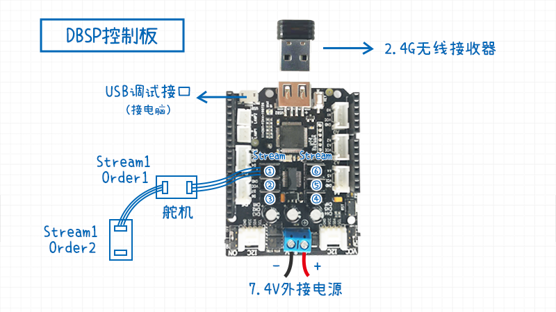

# PyDBSP

## 介绍

**PyDBSP**是DBSP舵机开发板的Python SDK, 可以通过Python调用DBSP里面的动作组,也可以单独控制单个/多个DBSP舵机。
 
在任意PC(包括树莓派的usb与硬件串口)都可以运行PyDBSP,另外还提供了树莓派串口配置的详细文档.

## 文档目录

* [树莓派硬件串口配置与实验](doc/树莓派硬件串口配置与实验/树莓派硬件串口配置与实验.md)
* [树莓派与DBSP进行串口通信](doc/树莓派与DBSP进行串口通信/树莓派与DBSP进行串口通信.md)
* [PyDBSP例程演示](doc/PyDBSP例程演示/PyDBSP例程演示.md)