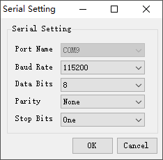

# PyDBSP使用指南


## 概要

**PyDBSP**是DBSP舵机开发板的Python SDK.　本文讲解了如何使用`PyDBSP`, 并提供了相关的示例代码.

你可以通过`src`文件下的`PyDBSP例程演示.ipynb` 实验这些示例代码

> 注: `.ipyb`文件需要通过Jupyter Notebook打开.


## 目录

[TOC]

## 导入依赖


```python
import time

# PySerial库用于串口通信
# 使用此脚本之前, 请确保已经安装好了PySerial
# PySerial安装过程及使用说明见官方文档
# https://pyserial.readthedocs.io/en/latest/pyserial.html
import serial

# 自定义的PyDBSP库文件, 将dbsp.py放置在测试工程的同极目录
from dbsp import *
```

##  初始化DBSP

DBSP的初始化步骤如下:
1. 给DBSP控制板上电
2. 然后用USB线将DBSP开发板上面的`usb1`与PC相连.
3. 查看设备在PC上挂载的端口号. 
   在Windows下, 端口编号为`COM?`, 例如`COM3`. 
   在Linux下, 端口编号为`/dev/ttyACM?`, 例如`/dev/ttyACM1`
   修改下方的`PORT_NAME`变量
4. 创建Serial对象
   串口通信的配置如下:
   
   
5. 初始化DBSP类
6. 设置通信协议模式


```python
# 请修改端口名称
PORT_NAME = '/dev/ttyACM0'
    
# 创建串口对象
# PySerial相关的API文档
# https://pyserial.readthedocs.io/en/latest/pyserial_api.html  
# 设置timeout=0 不等待直接返回
uart = serial.Serial(port=PORT_NAME, baudrate=115200,\
                     parity=serial.PARITY_NONE, stopbits=1,\
                     bytesize=8,timeout=0)

# 初始化DBSP
DBSP.init(uart, is_debug=False)
```

设置通信协议模式
注: **必须设置通信协议模式, 否则DBSP将不能正确解析接受到的数据.**


```python
def set_trans_mode_callback(*args):
    '''设置协议模式的回调函数'''
    is_ok, mode = args
    print('通信协议模式设置是否成功 : {}'.format(is_ok))

event = SetTranmissionMode()
event.set_callback(set_trans_mode_callback)
DBSP.add(event)
```

    通信协议模式设置是否成功 : True


## 舵机控制


不同与串口舵机, DBSP舵机的ID是自动分配的.

舵机与DBSP主板的连接方式，串联顺序就决定了这个舵机的唯一标识。

**Stream 流** 代表DBSP舵机是接在DBSP开发板的第几个舵机接口上，编号从1-6

**Order 顺序** DBSP舵机是串联的，在一个Stream上的舵机，按照离开发板的距离，直接连在开发板上的舵机编号为1，后续依次递增。


###  舵机列表查询

查询目前DBSP开发板上所有的舵机ID列表


```python
'''
测试舵机查询功能
'''
def query_list_callback(*args):
    print('Query Servo List Callback Function')
    print(args)
    srv_num, srv_id_list = args
    print('舵机个数: {}'.format(srv_num))
    print('舵机列表如下: ')
    for srv_id in srv_id_list:
        stream, order = DBSPUtil.servo_id2stream_order(srv_id)
        print('* 舵机 ID: {} Stream: {}  Order:{}'.format(srv_id, stream, order))
        
query_servo_list = QueryServoList()
query_servo_list.set_callback(query_list_callback)

DBSP.add(query_servo_list)
```

    Query Servo List Callback Function
    (2, (65, 97))
    舵机个数: 2
    舵机列表如下: 
    * 舵机 ID: 65 Stream: 4  Order:1
    * 舵机 ID: 97 Stream: 6  Order:1


如果在测试的时候, 插在DBSP上的舵机的ID并没有被识别出来, 可以做如下尝试:

1. 保持舵机与DBSP主板的连接, 将DBSP开发板与PC断开, 关闭DBSP的电源, 重启DBSP. 

   重新创建UART连接(此时可能需要修改设备端口号)

2. 更换电池电源. 因为在低点亮的情况下, 舵机可能会掉线.　或者换用学生电源(7.4v)

3. 更换舵机, 或者更换舵机接口

### 舵机状态查询

替换要查询的舵机ID `servo_id`, 如果对应的舵机ID并没有挂载在DBSP开发板上,会有相关的提示.


```python
# 修改这里的舵机ID号
# 舵机ID号的16进制表示
servo_id = 0x41

def query_servo_info_callback(*args):
    '''查询舵机信息的回调函数'''
    srv_num, srv_info_list = args
    print('舵机信息列表长度: {}'.format(srv_num))
    for srv_info in srv_info_list:
        print(srv_info)
    
query_servo_info = QueryServoInfo(servo_id)
query_servo_info.set_callback(query_servo_info_callback)

DBSP.add(query_servo_info)
```

    舵机信息列表长度: 1
      Servo 65 = 0x41
        angle        : 2
        current      : 0
        temperature  : 1774
        servo type   : 31517
        is start     : False
        is hold      : False


如果不指定舵机ID, 返回的是所有舵机的信息


```python
query_servo_info = QueryServoInfo()
query_servo_info.set_callback(query_servo_info_callback)

DBSP.add(query_servo_info)
```

    舵机信息列表长度: 2
      Servo 65 = 0x41
        angle        : 2
        current      : 0
        temperature  : 1774
        servo type   : 44100
        is start     : False
        is hold      : False
    
      Servo 97 = 0x61
        angle        : 64
        current      : 0
        temperature  : 1827
        servo type   : 44388
        is start     : False
        is hold      : False


### 设置舵机角度

角度设置默认单位是`ADC`的取值, 取值范围是`[-95, 95]`, 数据类型为整数. 
如果想控制机器人关节的角度的话, 可以对舵机进行**标定**, 获得角度/弧度与ADC之间的线性函数, 把角度转换为ADC数值,然后给DBSP发送舵机`ADC`控制信息.

在设置舵机角度的时候, 还需要设置**时间间隔 Interval**, 数据类型为整数, 单位是`1ms`. 例如`interval=100` 就代表延时100ms.

将舵机的角度控制信息依次放入`Tuple`数据中.
例如我们想让`0x41`号舵机在`100`ms内旋转到`60`度(其实是ADC的取值)，写成Tuple数据格式就是`(0x41, 60, 100)`

> 注: 如果角度设置之后没有相应, 可以尝试修改目标角度, 再次运行


```python
servo_angle_list = [(0x41, 60, 100)]
event = ServoAngleControlEvent(servo_angle_list)
DBSP.add(event)
```

也可以同时设置多个舵机的角度, 例如

```python
servo_angle_list = [(0x31, 50, 1000), (0x32, -50, 1000), (0x33, 90, 200)]
event = ServoAngleControlEvent(servo_angle_list)
DBSP.add(event)
```

## Action动作

**Action 动作指令**，是**DBSP指令**中的一种类型， 它包含了各个舵机对应的目标角度，以及花多长时间运动到该目标角度。


在DBSP的工程文件（后缀为`.svproj`)里查到所有的Action以及Action的详细信息.

样例`Action`的XML源码如下:
```xml
<Actions>
    <Action ID="800933234" Caption="turn_left_03">
      <Steps>
        <Step Stream="1" Order="1" Degree="-49" Interval="300" />
        <Step Stream="1" Order="2" Degree="-2" Interval="300" />
        <Step Stream="1" Order="3" Degree="-1" Interval="300" />
        <Step Stream="1" Order="4" Degree="11" Interval="300" />
        <Step Stream="2" Order="1" Degree="-90" Interval="300" />
        <Step Stream="2" Order="2" Degree="-80" Interval="300" />
        <Step Stream="2" Order="3" Degree="0" Interval="300" />
        <Step Stream="4" Order="1" Degree="90" Interval="300" />
        <Step Stream="4" Order="2" Degree="81" Interval="300" />
        <Step Stream="4" Order="3" Degree="0" Interval="300" />
        <Step Stream="5" Order="1" Degree="41" Interval="300" />
        <Step Stream="5" Order="2" Degree="-37" Interval="300" />
        <Step Stream="6" Order="1" Degree="64" Interval="300" />
        <Step Stream="6" Order="2" Degree="-1" Interval="300" />
        <Step Stream="6" Order="3" Degree="-19" Interval="300" />
        <Step Stream="6" Order="4" Degree="10" Interval="300" />
      </Steps>
    </Action>
    ....其他Action
<Actions>
```

此`Action`的标题`Caption`为`turn_left_03`, `ID`号为`800933234`

```xml
<Action ID="800933234" Caption="turn_left_03">...</Action>
```


`<Step>`里面指定了舵机的ID`Stream + Order `, 目标角度`Degree`, 以及旋转到目标角度所需要的时间`Interval`, 单位ms.


需要找出这个Action里面所有Step里面最大的`Interval`作为此Action的总的`Interval`


**注: 在执行Action前, 请确保工程文件已经上传到DBSP主板上, 且调用次Action的Marco存在于Joystick游戏手柄的映射表里面**

### 执行Action


```python
TURN_LEFT_ACTION_ID = 800933234 # Action的ID
TURN_LEFT_INTERVAL = 300 # Action执行所需要的时间，单位ms
action = ActionEvent(TURN_LEFT_ACTION_ID, TURN_LEFT_INTERVAL)
DBSP.add(action)
```

## Marco巨集

**Marco巨集** 由若干个**Command指令**构成，指令按照时间顺序依次执行。

**Command指令**有很多**Type 类型** 

- `Delay` 延时指令

  可以设置不同的延时时间，每个延时时间会创建一个Delay指令，延时多少ms，它的ID就是多少。
  
  样例: `<Command ID="200" Type="Delay" Ratio="100" Loop="1" />`

- `Action` 动作指令

- `Marco` 巨集 , Marco也可以由其他的Marco构成，但是只支持单层嵌套


与Action类似, 获取Marco的ID还有其他信息, 也需要查阅DBSP的工程源码

样例Marco的源码如下所示:

```xml
 <Marcos>
    <Marco ID="1913442680" Caption="turn_left_step" Reserved="0">
      <Commands>
        <Command ID="397359613" Type="Action" Ratio="100" Loop="1" />
        <Command ID="200" Type="Delay" Ratio="100" Loop="1" />
        <Command ID="1598552266" Type="Action" Ratio="100" Loop="1" />
        <Command ID="200" Type="Delay" Ratio="100" Loop="1" />
        <Command ID="800933234" Type="Action" Ratio="100" Loop="1" />
        <Command ID="200" Type="Delay" Ratio="100" Loop="1" />
        <Command ID="746696029" Type="Action" Ratio="100" Loop="1" />
        <Command ID="200" Type="Delay" Ratio="100" Loop="1" />
      </Commands>
    </Marco>
     ...其他Marco...
</Marcos>
```

此Marco的名称`Caption`为`turn_left_step`向左转, ID为`1913442680`
```xml
<Marco ID="1913442680" Caption="turn_left_step" Reserved="0">...</Marco>
```

将Marco里面所有的指令的耗时加在一起, 就是这个Marco的总的耗时`Interval`. 可以通过DBSP的上位机查看时间统计.


**注: 请确保工程文件已经上传到DBSP主板上, 且Marco存在于Joystick游戏手柄的映射表里面**


### 查询Marco列表


```python
query_marco_evt = QueryMarcoList()

def query_marco_evt_callback(*args):
    marco_num, marco_list = args
    print('Marco Num: {}'.format(marco_num))
    for marco_id, marco_name in marco_list:
        print('Marco ID: {}  Marco Name: {}'.format(marco_id, marco_name))

query_marco_evt.set_callback(query_marco_evt_callback)

DBSP.add(query_marco_evt)
```

    Marco Num: 8
    Marco ID: 166367466  Marco Name: b'init_pose'
    Marco ID: 1656218031  Marco Name: b'go_forward_step'
    Marco ID: 1913442680  Marco Name: b'turn_left_step'
    Marco ID: 316806338  Marco Name: b'turn_right_step'
    Marco ID: 915727867  Marco Name: b'go_backward_step'
    Marco ID: 1745398858  Marco Name: b'none'
    Marco ID: 37173147  Marco Name: b'shift_right_step'
    Marco ID: 1962515968  Marco Name: b'shift_left_step'


### 运行Marco


```python
INIT_MARCO_ID = 166367466 # 获取Marco ID,需要查阅DBSP的工程文件XML里面的ID, 或者根据上面的Marco ID查询列表输出日志
INIT_MARCO_INTERVAL = 300 # ms Marco的总时间长度 (在DBSP的上位机上可以查到)
marco = MarcoEvent(INIT_MARCO_ID, INIT_MARCO_INTERVAL)
DBSP.add(marco)
```

## 延时

在机器人的不同的动作之间插入时间延时


```python
delay_ms = 1000 # 延时时间, 单位ms
event = DelayEvent(delay_ms)
DBSP.add(event)
```

## 按键


**JoystickTable 遥控手柄控制表** 定义了**Joystick 遥控手柄**不同的按键与状态与Marco巨集（用Marco的ID号来表示）之间的映射关系。

按键状态如下:

- 按键按下 `ButtonPress`
- 按键长按 `ButtonLongPress`
- 按键释放 `ButtonUp`


**注意事项**

1. 请确保游戏手柄与DBSP(USB2口上有无线接收器)建立无线连接. 游戏手柄指示灯`RX`常亮
2. 只有在JoystickTable里面编辑了映射关系的Marco，在上传(upload)的时候，　Marco才会被保存在DBSP主控板里面。在IDE中新建Marco的时候，这个Marco并没有保存在DBSP主板上，IDE是通过发送舵机角度控制指令来完成测试的。　
3. 如果一个按键没有编辑好与之对应的Marco，在MaixPy订阅了DBSP的按键事件之后, 该按键也不会产生回调函数。　

### 按键事件订阅与回调


```python
def button_callback(button_id, button_state):
    '''按键事件回调函数'''
    print('[INFO] Callback\n    button_id={} button_state={}'.format(button_id, button_state))

def subscribe_button_callback(is_subscribe, is_ok):
    '''订阅按键事件成功后的回调函数'''
    if is_ok:
        if is_subscribe:
            btn_event = ButtonEvent()
            btn_event.set_callback(button_callback)
            # 订阅按钮事件
            print('Subscribe Button Event')
            DBSP.add(btn_event)
        else:
            pass

sbs_btn_evt = SubscribeButtonEvent()
sbs_btn_evt.set_callback(subscribe_button_callback)
DBSP.add(sbs_btn_evt)
```

    Subscribe Button Event

