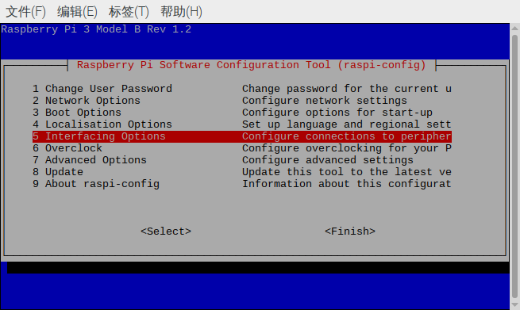
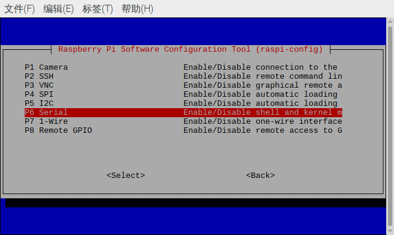
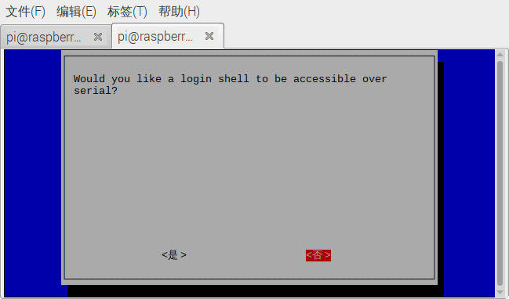
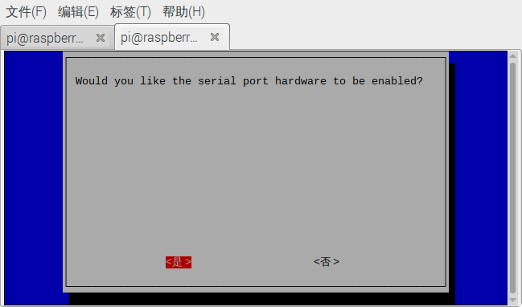
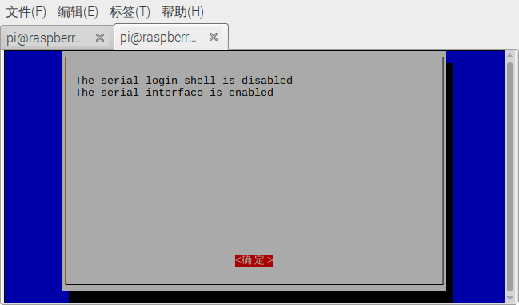
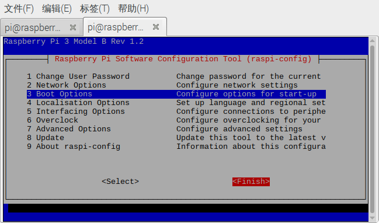
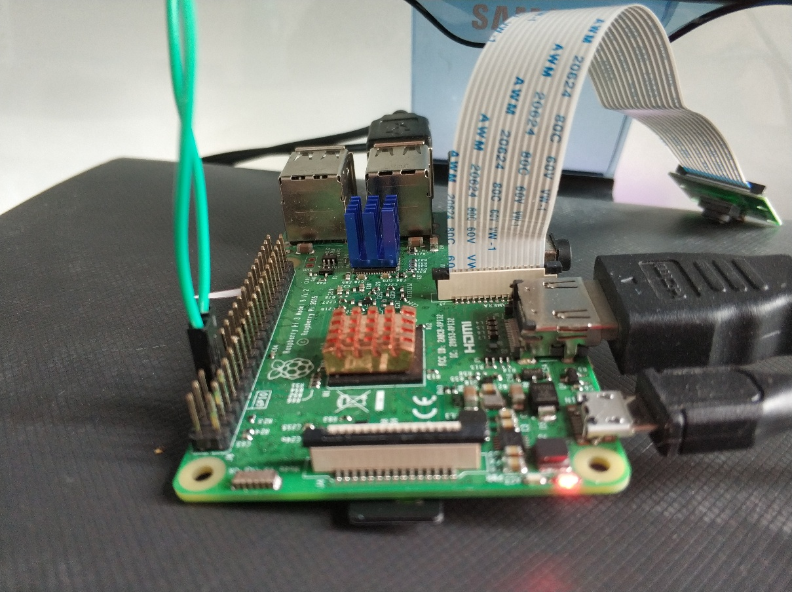

## 硬件串口配置

树莓派3上面的`TX`与`RX`默认映射的是软串口, 而硬件串口被分配给了蓝牙. 为了获得稳定的串口通信质量, 需要牺牲蓝牙, 将板载的`TX`,`RX` 管脚映射到硬件串口上面.


### 打开串口开关

通过`raspi-config`打开串口开关

运行raspi-config

```bash
sudo raspi-config
```

进入配置界面

选择`5. Interfacing Options`



选择`P6 Serial`， 设置串口相关配置




树莓派的硬件串口资源默认用于 **串口终端调试**，如要想通过串口与其他单片机进行通信, 则需要关闭串口终端调试功能。 
选择`否`



是否打开硬件串口, 选择`是`



显示配置结果




如果想退出raspi-config, 按下方向键的`右键` , 选中`Finish`然后回车



### 管脚重映射
让蓝牙的串口映射到mini-uart上,  让硬件串口UART0 `/dev/ttyAMA0`映射到GPIOs 14 & 15

在`boot/config.txt`文件末尾追加一行

```
dtoverlay=pi3-miniuart-bt
```


### 串口访问权限问题

添加用户`pi`到`tty`还有`dialout`用户组

```bash
sudo usermod -a -G tty pi
```

```bash
sudo usermod -a -G dialout pi
```


### 重启Rasberry Pi


重启树莓派让配置生效

```bash
reboot
```


### 参考文档

[树莓派UART注意事项-官方文档](https://www.raspberrypi.org/documentation/configuration/uart.md)

[树莓派串口通信设置](https://zhuanlan.zhihu.com/p/38853178)

[Raspberry Pi 3 UART Boot Overlay Part Two](https://www.cnblogs.com/raffeale/articles/5575162.html)


## 自发自收实验

在运行此实验之前, 请将树莓派的`RX`跟`TX`用杜邦线链接在一起


实物图, 见图中的绿色杜邦线




创建串口对象


```python
import serial

# 树莓派 硬件串口的端口号
PORT_NAME='/dev/ttyAMA0'

# 创建串口对象
# PySerial相关的API文档
# https://pyserial.readthedocs.io/en/latest/pyserial_api.html  
# 设置timeout=0 不等待直接返回
uart = serial.Serial(port=PORT_NAME, baudrate=57600,\
                     parity=serial.PARITY_NONE, stopbits=1,\
                     bytesize=8,timeout=0)
```

准备发送的信息


```python
info = 'Hello World'
```

将字符串编码为utf8格式的字节数组， 通过uart发送出去


```python
info_byte = info.encode('utf8')
```


```python
uart.write(info_byte)
```


    11


等待一段时间之后，运行下面的cell


```python
uart.read_all()
```


    b'Hello World'


可以看到接收端收到了刚才发送端的消息
